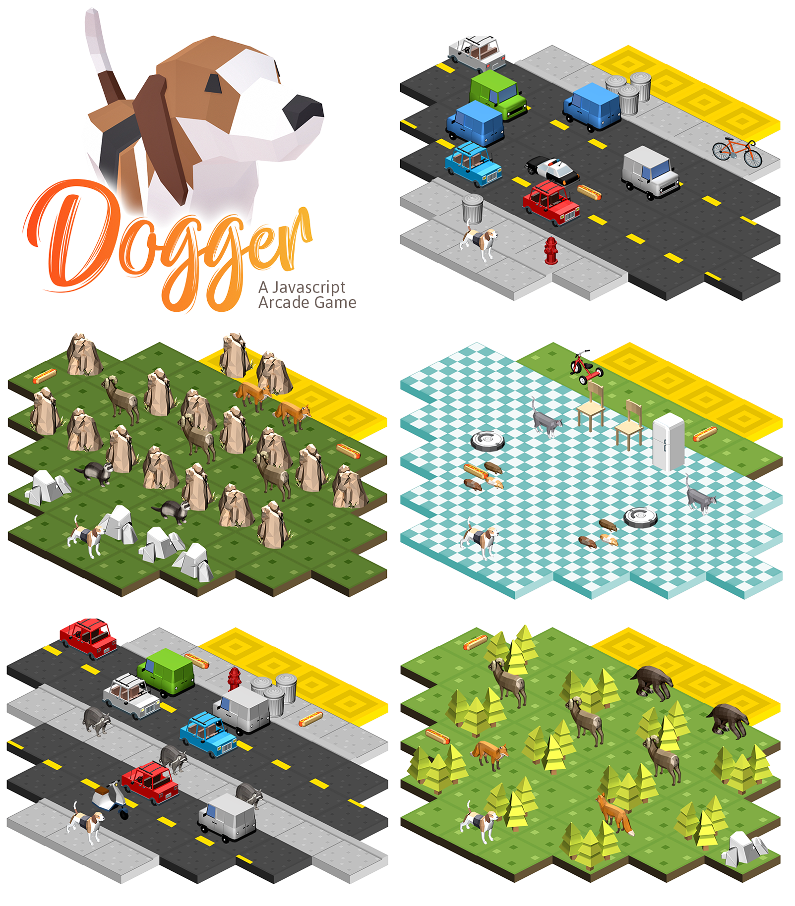
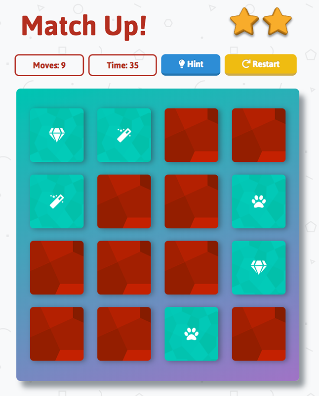

Various projects I've worked on with code, design or otherwise.
* [Alexandria](#alexandria)
* [Dogger](#dogger)
* [Match Up](#matchup)
____________

  

# Dogger

A book tracking app that allows users to search for books and add them to lists of "Read", "Reading", or "Want to Read." 
Progressive web app, responsive design, and interacts with a Udacity API that provides a limited number of books.
[Try the App](https://alexandria.atrost.com/)   -    [Check the Code](https://github.com/a-trost/alexandria)
#### Tools Used
 * React
 * React Router
 * Javascript
 * Material-UI
 * Git
 * Netlify
____________

  

# Dogger

A play off of Frogger, made in JavaScript. 15 levels of dodging enemies and eating hot dogs.
[Play the Game](https://dogger.atrost.com/)   -    [Check the Code](https://github.com/a-trost/dogger)
#### Tools Used
 * JavaScript
 * HTML
 * CSS
 * Photoshop
 * Blender
 * Git
____________

# Match Up

A memory card game made in JavaScript. Hints are for people who like winning quickly.
[Play the Game](https://matchup.atrost.com/)   -    [Check the Code](https://github.com/a-trost/memory-game)
#### Tools Used
 * JavaScript
 * HTML
 * CSS
 * Illustrator
 * Git